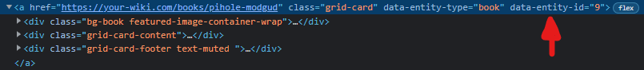

# Bookstack sort shelf content

You can use this snippet to sort the books on your shelves as well as sort the shelves in the shelves overview page 🎉.

### Reason
I wanted to be able to sort books within my Bookstack shelf. Unfortunately this is not a feature within Bookstack, so I created this little JS snippet to do it.

### Requirements
- Access to the `Custom HTML Head Content` option in the settings page
- A little bit of knowledge on how to use the `Inspect element` option in your favourite browser (Chrome, Firefox, whatever)

## The snippet

### Explanation
To use the snippet you need to change the config to your liking. The variable `orders` is a list of configs, a config should have a path and items. The path is the trailing part of the shelf's url. `items` is a list of objects that contain the `data-entity-id` value of the books in your shelf. The position of the items in this list is what determines the order the books will be displayed in

#### Extras
The `<style>` at the bottom sets the default order for all items. You may want to change this to a different number for your specific use case.
When the books are ordered the sort drop down is also greyed out and disabled. Since it will not really have an effect anymore.

### The HTML code
 ```html
 <script>
    const orders = [
        {
            "path": "/shelves", // This is for the Shelves page
            "items": [
                { "dataId": 2 },
                { "dataId": 6 },
                { "dataId": 1 },
                { "dataId": 3 },
            ]
        },
        {
            "path": "/shelves/it-services", // This is an example of ordering books on a shelf
            "items": [
                { "dataId": 18 },
                { "dataId": 9 },
                { "dataId": 8 },

                { "dataId": 17 },
                { "dataId": 5 },
                { "dataId": 15 },

                { "dataId": 7 },
                { "dataId": 14 },
                { "dataId": 19 },
            ]
        },
    ];

    document.addEventListener("DOMContentLoaded", function () {
        const pathName = window.location.pathname;
        if (pathName == null) return;

        const orderConfig = orders.find(order => order.path === pathName);
        if (orderConfig == null) return;

        document.getElementsByClassName('list-sort-container').forEach(sort => {
            sort.style.opacity = 0.2;
            sort.style.pointerEvents = 'none';
        });
        const cards = document.querySelectorAll(".book-content .grid-card");
        for (const card of cards) {
            let dataId = card.getAttribute('data-entity-id');
            const orderConfigOrder = orderConfig.items.findIndex(item => item.dataId == dataId);
            if (orderConfigOrder == null) continue;

            card.style.order = orderConfigOrder;
        }
    });
</script>

<style>
    .grid-card {
        order: 100;
    }
</style>
```

### How to find the `data-entity-id`
Open the inspector on the page, easiest way to do this is to right click on a book and then choose the `Inspect element` option like in the image below


Then find your book's html (if you right clicked on the book and selected the `Inspect element` option, your book's html should be close to what is highlighted in the inspector as it opened)



